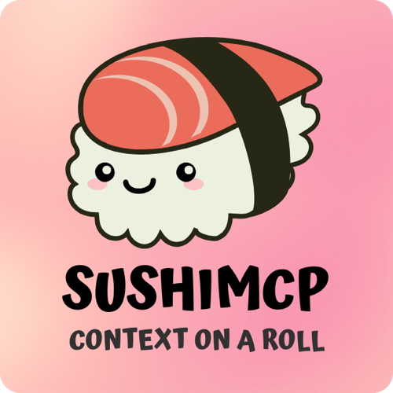

<div align="center">



</div>

# SushiMCP

SushiMCP is a model context protocol server designed to assist developers with delivering context to their AI IDE's. It's simple to use and massively improves the performance of base and premium LLM models when generating code. The easiest way to get started is by registering SushiMCP with your client using the default configuration:

<br>

## Registering SushiMCP with an MCP Client

```json
{
  "sushimcp": {
    "command": "npx",
    "args": ["@chriswhiterocks/sushimcp@latest"]
  }
}
```

<br>

## Advanced Configuration & Deeper Learning

Visit the [SushiMCP Docs](https://docs.sushimcp.com) for more information on advanced configuration and deeper learning about SushiMCP.

<br>

## Author

Chris White: [Email](mailto:chris@chriswhite.rocks) | [GitHub](https://github.com/maverickg59) | [Discord](https://discord.com/users/1115027188840939560) | [Personal Site](https://chriswhite.rocks) | [X](https://x.com/chriswhiterox) | [LinkedIn](https://www.linkedin.com/in/chrisewhite) | [Five9 Cyber](https://www.fiv9cyber.com/)

<br>

## License

This project is licensed under the AGPL-3.0-or-later. See the `license.txt` file for details.
